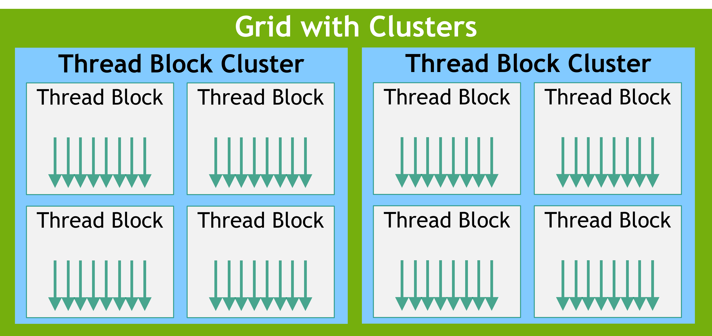
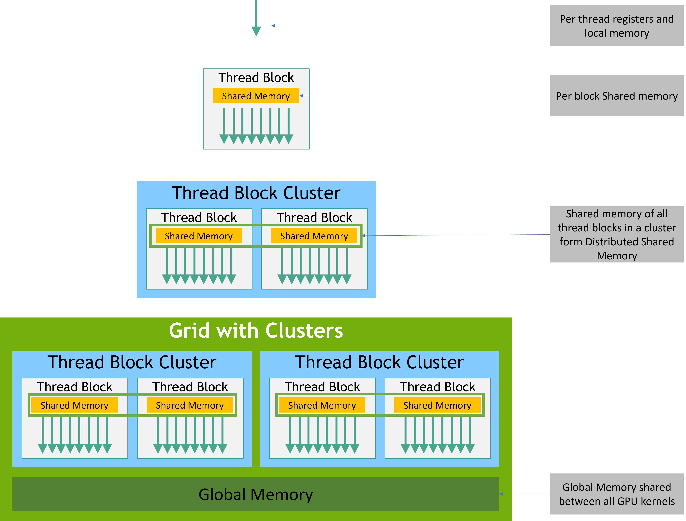

## 1 GPU 硬件模型

下图所示为 GPU 的硬件模型：


*图片来源：https://docs.nvidia.com/cuda/cuda-programming-guide/01-introduction/programming-model.html#gpu-hardware-model*

关键概念：

`Streaming Multiprocessor(SM)`：一个"自带计算 + 存储 + 调度"的小处理器。其内部大致有以下几类东西：
- 计算单元：CUDA cores（执行整数和单精度浮点 FP32 运算的基本单元）、FP64 单元（计算双精度浮点）、Tensor Cores（张量核心，专门加速矩阵乘法）、Special Function Units（特殊函数单元，算 sin、cos、exp、平方根这类超越函数）。
- 存储单元：Register File（寄存器文件，最快、最大的一块儿片上存储）、Shared Memory/L1 Cache（极快，shared memory 和 L1 缓存通常共用同一块物理存储，可以配置分配比例）、Constant Cache/Texture Cache（缓存只读的常量数据、纹理数据）。
- 调度单元：Warp Scheduler（warp 调度器，每个 SM 上通常有多个 scheduler，所以一个周期能发射好几个 warp 的指令）、Dispatch Unit（分发单元，配合 warp scheduler 把选中的指令分发到具体的执行单元）、Instruction Cache（指令缓存）。


`GPU DRAM`：显存，在 GPU 上被称为 global memory，物理上是用 HBM（High Bandwidth Memory）实现的。

`GPC`：Graphics Processing Cluster，SM 之上的一级硬件分组，GPC 内部的 SM 之间物理距离更近、互联更快。


## 2 CUDA 编程模型

- `CPU`：host，其直连的内存称作 host memory
- `GPU`：device，其直连的内存称作 device memory

CUDA 应用总是从 CPU 上开始执行，通过调用 `kernel`（一个跑在 GPU 上的函数）来触发 GPU 代码运行。`kernel launch` 会启动很多 `threads` 在 GPU 上并行执行代码。

下图是 CUDA GPU code 的编程模型：

*图片来源：https://docs.nvidia.com/cuda/cuda-programming-guide/01-introduction/programming-model.html#thread-blocks-and-grids*

`threads` 被组织成 `blocks`，`blocks` 被组织成一个 `grid`。在一个 `thread block` 中，32 个 threads 被组织成一个 `warp`，它是执行时的调度单元；在 SIMT（Single-Instruction Multiple-Threads）中，一个 warp 中的所有 threads 会执行相同的 kernel code。


从 Hopper 架构开始，GPU 进一步引入了 `cluster` 编程层次：

*图片来源：https://docs.nvidia.com/cuda/cuda-programming-guide/01-introduction/programming-model.html#thread-block-clusters*


一个线程块（thread block）中的所有线程都在同一个 SM 上执行，block 一旦被分配，就整个驻留在某一个 SM 上。

一个簇（cluster）中的所有线程块都在同一个 GPC 上执行。由于物理距离近，它们之间可以做 distributed shared memory（跨 block 直接访问彼此的 shared memory）和 cluster 级别的同步，带来更快的实现，这一点在第 3 节的内存层次中还会提到。


下面我们把编程模型和 GPU 硬件模型对应一下：

| 编程模型 | 硬件 |
| --- | --- |
| thread | CUDA core / lane |
| warp | 调度单位（32 lane 锁步），Warp Scheduler |
| block | 驻留在一个 SM 上 |
| cluster | 驻留在一个 GPC 上 |
| grid | 整张 GPU |


## 3 内存层次

我们先从编程模型上看一下内存的层次：


*图片来源：https://docs.nvidia.com/cuda/cuda-c-programming-guide/#memory-hierarchy*

从 GPU 的真实物理内存角度，内存从慢到快、从大到小有：

```
系统内存(CPU DRAM / host memory)
   ↕ 跨 PCIe / NVLink 传输(慢,延迟高)
------------------ 以下是 GPU -----------------------
Global Memory(全局显存)= 物理上是 HBM(或旧卡GDDR)
   - 所有 SM/线程可访问、大(几十GB)、持久(跨kernel)
   - local memory 也在这里(线程私有但一样慢)
L2 Cache(全GPU共享，自动加速global memory访问)
---------- 以下在每个 SM 内部(片上，极快)---------------
L1 Cache / Shared Memory(共用物理空间，可配比例，也被称为 SRAM)
   - Shared Memory:block 内共享、极快、临时(随block消失)
Registers(寄存器)
   - 每线程私有、最快、最小
   - 不够用会溢出到线程 local memory(变慢)

另有:Constant Memory(只读、有专门缓存)、Texture Memory(只读、图形用)
```

速度排序：寄存器 > shared memory > L2 缓存 > global memory（HBM）> 跨 PCIe/NVLink 的系统内存。

把 global memory 的数据搬到 SM 片上 memory 复用是优化应用性能的有效方法。


## 4 其他问题

### 4.1 为什么要引入 warp 这一概念

答案：warp 是硬件为了效率而做的一个"打包"设计，直接用单个 thread 管理会低效到无法接受。

GPU 会有成千上万个线程同时跑，如果每个 thread 都完全独立管理：
- 会有巨大的"控制"硬件成本（如果每个线程都独立地取指令、解码，那就需要成千上万套"取指令 + 解码"的控制电路）。使用 warp 之后，取一次指令、解码一次，就能供 32 个线程一起用，控制成本一下降到 1/32，把省下来的芯片面积，全用来堆"计算单元"。
- 降低调度成本，否则要管几千个独立线程，负担太重。
- 因为 32 个线程是作为一个 warp 一起访存的，硬件可以把它们对连续地址的访问合并成一次大的高效传输。如果线程完全独立、各自随机时刻访存，就没法合并了，内存效率会大幅下降。

那为什么 warp 设为 32 而不是更大的数字呢？
- 我们知道 warp 里所有线程同时执行同一条指令，假设一个 if 条件，warp 里一半线程满足（要执行 if 里的代码）、一半不满足。因为 32 个线程必须"一起走"（只有一套控制逻辑），硬件没法让两半真正同时走不同的路。它的处理方式是：
    - 先执行 if 分支：让满足条件的那 16 个线程执行，不满足的 16 个线程被"屏蔽（masked off）"——它们在旁边"空转"、不干活、等着。
    - 再执行 else 分支：反过来，让另外 16 个线程执行，刚才那 16 个被屏蔽。
    - 也就是说：两个分支不是并行的，而是"串行"地一个一个走完，每次只有一部分线程在真正干活，另一部分在空等。如果 warp 太大（比如 128）的话，一旦线程要走不同分支（warp divergence），一大批线程被迫串行，浪费严重。
- block 线程数最好设成 warp 线程数的倍数，否则最后一个 warp 会有一些"空位（unused lanes）"。如果 warp 线程数设置得很大，block 线程数的设置就会不灵活；而且 block 线程数如果过大，可能影响性能，因为 SM 上也许没有足够的 register。


### 4.2 block / warp 在 SM 上是如何执行的呢

1. 驻留（resident）的 warp：一个 SM 上可以同时驻留很多个 warp。

    当 block 被分配到 SM 上时，block 里的所有 warp 都"住进"了这个 SM。
    一个 SM 可以同时容纳多个 block、几十个 warp（具体数量看硬件，比如常见的一个 SM 最多驻留 64 个 warp）。
    这些 warp 都"活着"、都在 SM 上，各自保留着自己的状态（寄存器等）。它们是"待命"或"轮流执行"的状态。

2. 正在发射/执行（issuing）的 warp：某一瞬间，SM 实际执行的是少数几个 warp。

    SM 内部有若干个"warp scheduler（warp 调度器）"和执行单元。
    每个时钟周期，warp scheduler 从"驻留的众多 warp"里，挑出"准备好了的"warp，发射它们的指令去执行。
    现代 SM 通常有多个 warp scheduler（比如 4 个），所以一个周期可以发射好几个 warp 的指令，但也就是少数几个，不是全部几十个。

3. GPU 通过"延迟隐藏"（latency hiding）机制获得高性能。

    让一个 SM 上驻留很多 warp。当 warp A 发起内存访问、开始等待时，SM 立刻切换去执行 warp B；warp B 又等了，就切到 warp C……等一圈回来，warp A 的数据可能已经到了，继续执行。
    这样，SM 的计算单元几乎一直有活干（总有某个 warp 是"准备好了的"），内存访问的漫长等待，被"切换到别的 warp 干活"给掩盖（hide）掉了，这就是 latency hiding。

### 4.3 Tensor Core 为何能加速矩阵乘

答案：CUDA core 的一条指令只做一次标量乘加，而 Tensor Core 的一条指令直接做一个小矩阵的乘加 `D = A × B + C`，把成百上千次乘加压缩进一条指令、几个周期里完成。

具体来说：

- **指令与控制开销被摊薄**。用 CUDA core 算矩阵乘，每个 lane 每周期只能出 1 次 FMA，M×N×K 次乘加就要发射 M×N×K/32 条指令，取指、解码、寄存器读写的开销全部按乘加次数线性增长。Tensor Core 是 warp 级指令（如 `mma.m16n8k16`），一条指令就是 16×8×16 = 2048 次乘加，控制开销被均摊到几乎为零。
- **数据复用发生在硬件内部**。Tensor Core 内部是一个乘加阵列，A 的一行、B 的一列被读进来后会同时喂给多个乘法器复用。用 CUDA core 时，同一个元素要被反复从寄存器文件里读出来，而寄存器读带宽恰恰是真正的瓶颈；Tensor Core 把这部分复用搬到了硬件里。
- **低精度输入 + 高精度累加**。输入用 FP16/BF16/FP8（甚至 INT8/FP4），累加用 FP32。位宽小 → 单个乘法器面积小 → 同样芯片面积能塞下多得多的乘法器，同时读操作数的带宽需求也同比下降；而累加保持 FP32，精度损失可控。

所以它的加速不是"频率更高"，而是**用一条指令换掉了大量指令，并把操作数复用做进了硬件**。

代价是它只对矩阵乘/卷积这类形状规整的运算有效：矩阵维度要对齐到固定的 m/n/k 倍数，数据在 shared memory 里的布局也要配合（`ldmatrix`、swizzle 避免 bank conflict）。而且 Tensor Core 算得太快，很容易变成"喂不饱"——数据搬运跟不上就会空转，这也是为什么要用 shared memory 分块、异步拷贝（`cp.async` / Hopper 的 TMA）来做流水，让搬数据和计算重叠起来。

**补充**：那么为什么"低精度输入 + 高精度累加"这个组合是可行的？本质是**乘法和累加对精度的需求根本不同**：

- **乘法这一步其实不损失精度**。FP16 尾数 11 bit，两个 FP16 相乘，乘积尾数最多 22 bit，完全放得进 FP32 的 24 bit 尾数里。所以 `a × b` 是精确的，误差只来自输入本身的量化（相对误差 ~1e-3），而且这个误差是"一次性"的，不会被放大。
- **累加才是误差真正累积的地方**。点积要连加 K 次（K 常有几千），误差随 K 增长（随机情况下 ~√K）。更要命的是 swamping（大数吃小数）：partial sum 越加越大，而 FP16 只有 ~1e-3 的相对精度，后面那些小的增量会被直接舍掉。K = 4096 时用 FP16 累加，结果可能错得离谱。所以累加器必须够宽。
- **输入降到 FP16/BF16 在深度学习场景可以忍**。神经网络的权重和激活有大量冗余，后面还接归一化和非线性；训练时梯度噪声本来就远大于 1e-3 的量化误差。BF16 更进一步：它保留 FP32 的 8 bit 指数（动态范围完全一致），只砍尾数，所以不容易上溢/下溢，训练时不需要 loss scaling，这也是它后来比 FP16 更流行的原因。

还有一点容易被忽略：Tensor Core 内部通常不是"逐次 FP32 相加"，而是把 K 个乘积在更宽的中间精度里一次性加完再 round 一次。所以它的数值精度往往**比 CPU 上串行的 FP32 累加还好**。
